<p align="center">
  
</p>

<h1 align="center">🧊 Smart Fridge — AI-Powered Ingredient & Recipe Manager</h1>

<p align="center">
  <em>Smart Fridge is an AI-powered mobile application that helps users manage food ingredients and discover recipes effortlessly.</em>
</p>

<p align="center">
  
  
  
  
  
  
</p>

---

## 📖 About

Smart Fridge is an AI-powered mobile application that helps users manage food ingredients and discover recipes effortlessly. The app uses **Computer Vision** to identify ingredients from images captured by the user and automatically stores them in a **virtual refrigerator**.

By integrating **Google's Gemini AI**, the application analyzes the available ingredients and generates personalized recipe recommendations based on what the user currently has. This reduces food waste, simplifies meal planning, and provides a smarter cooking experience.

---

## 🎬 Demo Video

<!-- Add your demo video below. You can use a direct link or embed a YouTube/Vimeo video. -->

<p align="center">

<!-- Or use an image link to YouTube: -->
<!-- [](https://www.youtube.com/watch?v=YOUR_VIDEO_ID) -->

</p>


https://github.com/user-attachments/assets/7bb8679d-0127-4b04-b605-b6ffee916355


---

## 📸 Screenshots

### Light Mode & Dark Mode

| Screen | Light Mode | Dark Mode |
|:------:|:----------:|:---------:|
| **Home** | 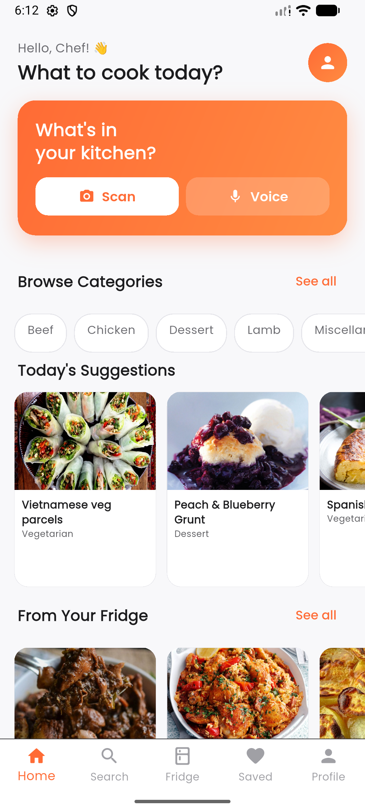 | 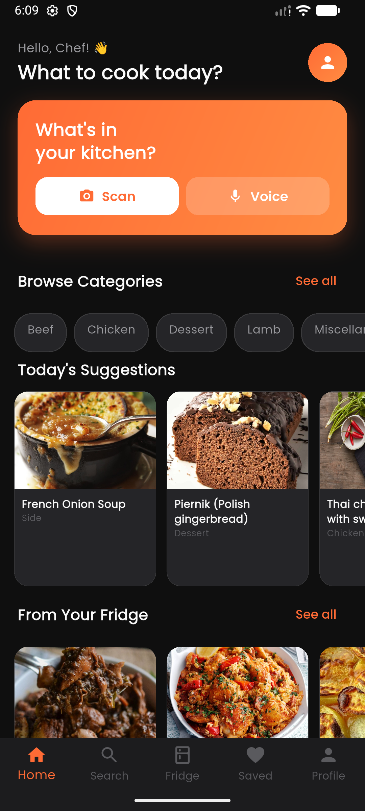 |
| **Search** | 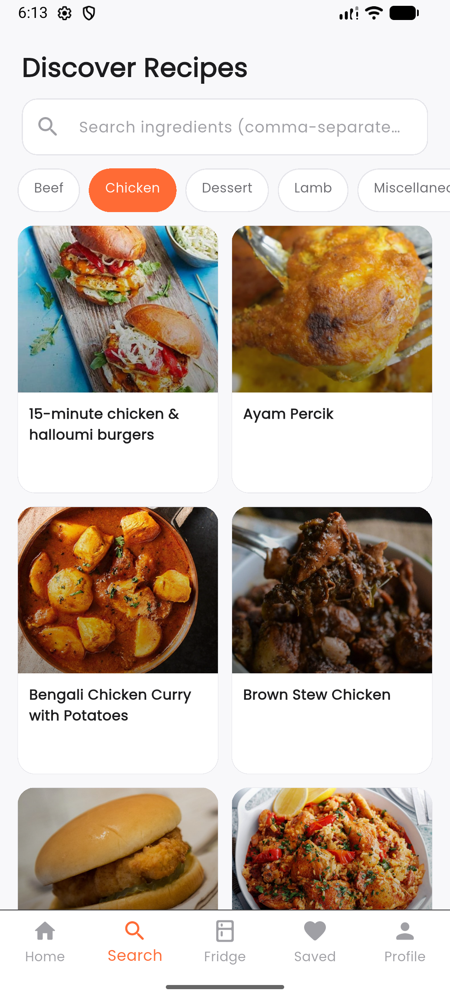 | 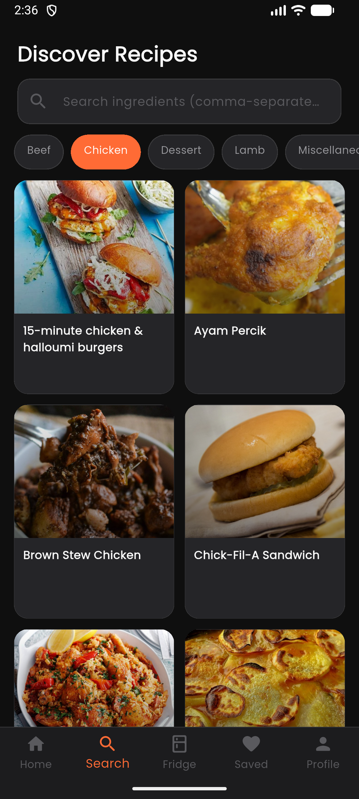 |
| **Recipe Info** | 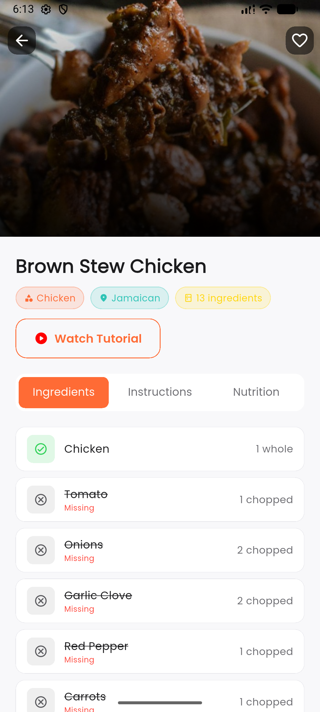 | 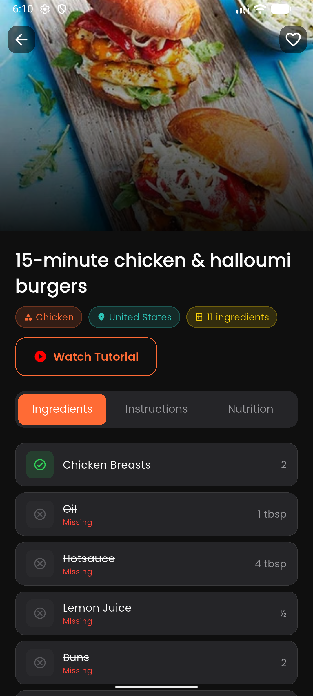 |
| **My Items (Virtual Fridge)** | 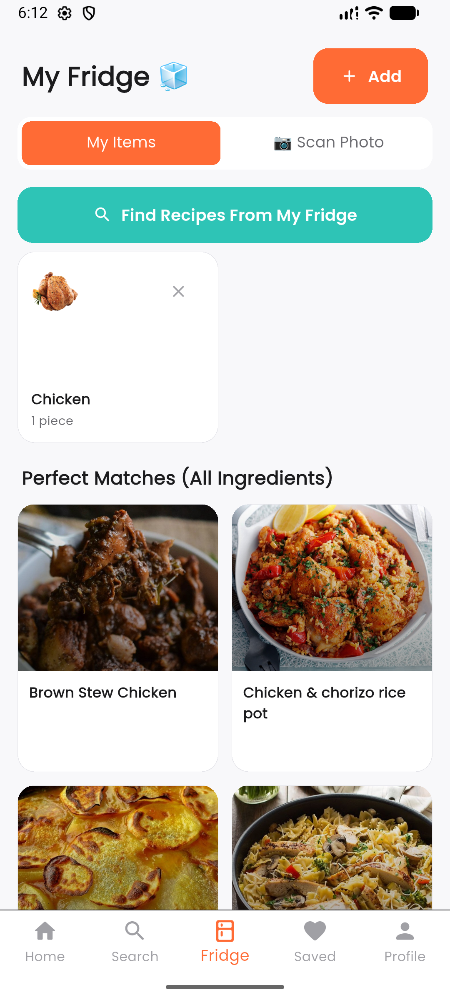 | 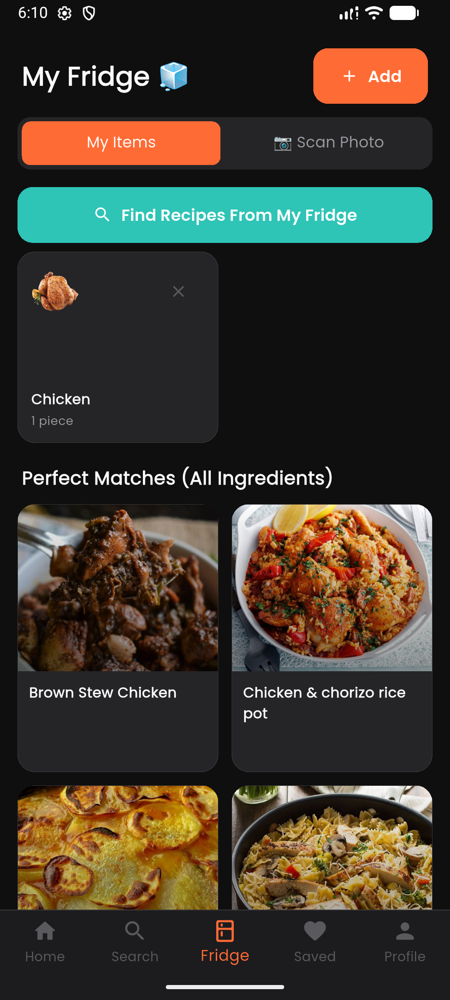 |
| **Saved Recipes** | 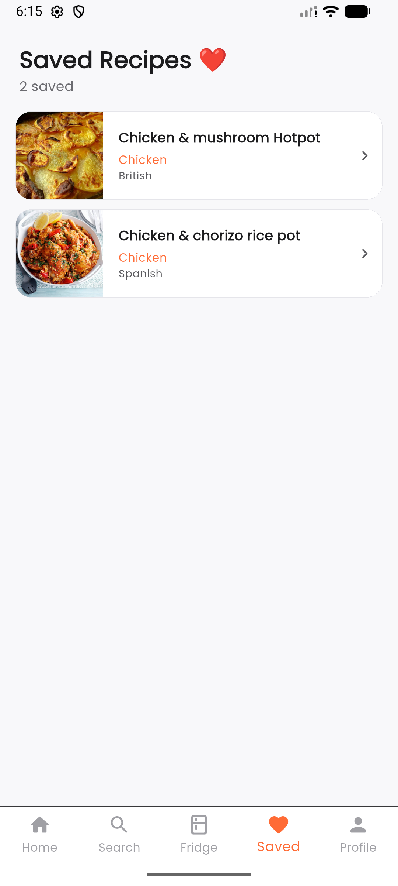 | 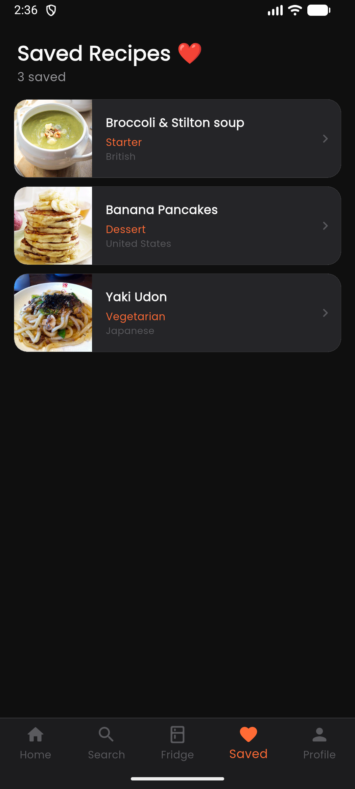 |
| **Profile** | 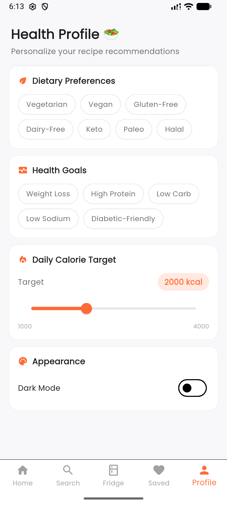 | 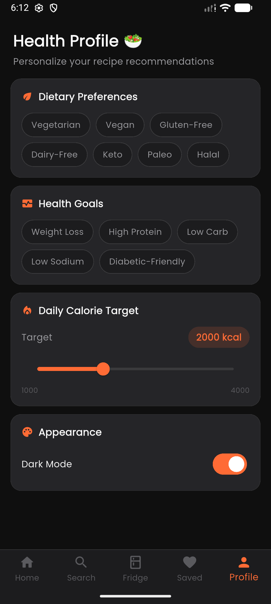 |
| **Voice Search** | 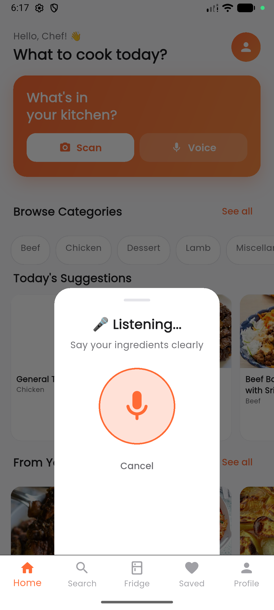 | 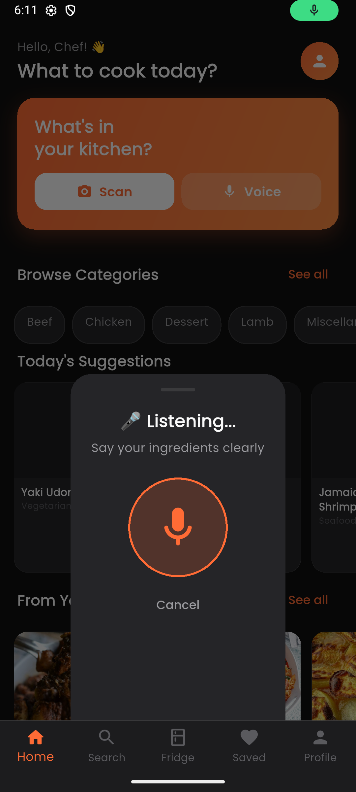 |

### Other Screens

| Screen | Preview |
|:------:|:-------:|
| **Scan Photo** | 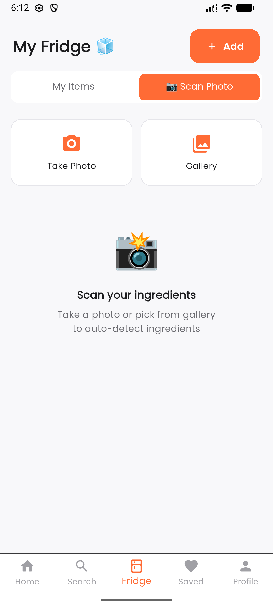 |
| **Loading** | 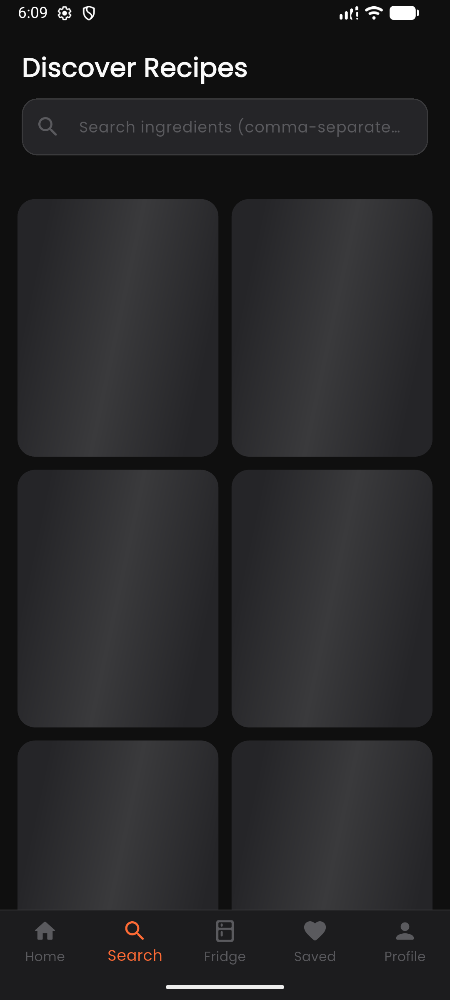 |

---

## ✨ Key Features

- 📷 **Ingredient Recognition** — Uses Computer Vision (Google ML Kit) to identify ingredients from camera images
- 🧊 **Virtual Refrigerator** — Manage and organize your available ingredients in a digital fridge
- 🤖 **AI-Powered Recipe Recommendations** — Gemini AI analyzes your ingredients and suggests personalized recipes
- 📊 **Real-Time Ingredient Tracking** — Keep your fridge inventory up-to-date with easy add/remove
- 🔍 **Smart Search** — Search meals by name, category, area, or ingredient
- 🎤 **Voice Search** — Speak to find recipes hands-free using speech-to-text
- 💾 **Save Recipes** — Bookmark your favorite meals for quick access
- 🏥 **Health Profile** — Set dietary preferences and health conditions for personalized results
- 🌗 **Dark & Light Mode** — Full theme support with smooth transitions
- ⚡ **Offline Support** — Local storage with Hive for saved recipes and fridge items
- 🎨 **Beautiful Animations** — Lottie animations, shimmer loading, and smooth transitions

---

## 🏗️ Architecture

Smart Fridge follows **Clean Architecture** principles with a feature-first folder structure and uses the **BLoC / Cubit** pattern for state management.

```
┌─────────────────────────────────────────────┐
│              Presentation Layer              │
│       (Pages, Widgets, BLoCs/Cubits)         │
├─────────────────────────────────────────────┤
│                Domain Layer                  │
│       (Entities, Use Cases, Repos)           │
├─────────────────────────────────────────────┤
│                 Data Layer                   │
│  (Models, DataSources, Repo Implementations) │
└─────────────────────────────────────────────┘
```

---

## 📁 Folder Structure

```
lib/
├── main.dart                          # App entry point — initializes Hive, DI, env, and runs Smart Fridge app
│
├── core/                              # Shared core modules
│   ├── constants/
│   │   └── api_constants.dart         # API base URLs, endpoints, and Gemini key config
│   ├── di/
│   │   └── injection.dart             # Dependency injection setup using GetIt
│   ├── error/
│   │   ├── exceptions.dart            # Custom exception classes
│   │   └── failures.dart              # Failure classes for error handling
│   ├── navigation/
│   │   └── app_router.dart            # GoRouter configuration and route definitions
│   ├── network/
│   │   └── dio_client.dart            # Dio HTTP client setup
│   ├── theme/
│   │   ├── app_theme.dart             # Light & dark theme data definitions
│   │   └── theme_cubit.dart           # Theme mode state management (light/dark toggle)
│   └── widgets/
│       ├── app_loading_skeleton.dart   # Shimmer loading skeleton widget
│       └── app_widgets.dart           # Shared reusable UI components
│
└── features/                          # Feature modules (Clean Architecture)
    │
    ├── health_profile/                # 🏥 Health Profile Feature
    │   ├── domain/
    │   │   ├── entities/
    │   │   │   └── health_profile_entity.dart
    │   │   └── usecases/
    │   └── presentation/
    │       └── pages/
    │           ├── health_profile_cubit.dart
    │           └── health_profile_page.dart
    │
    ├── home/                          # 🏠 Home Feature
    │   ├── data/
    │   ├── domain/
    │   │   └── usecases/
    │   │       └── detect_ingredients_from_image.dart
    │   └── presentation/
    │       ├── cubits/
    │       │   ├── camera_cubit.dart   # Camera state management
    │       │   ├── home_cubit.dart     # Home page state management
    │       │   └── voice_cubit.dart    # Voice search state management
    │       ├── pages/
    │       │   └── home_page.dart
    │       └── widgets/
    │           ├── camera_scan_sheet.dart   # Camera scanning bottom sheet
    │           └── voice_scan_sheet.dart    # Voice search bottom sheet
    │
    ├── onboarding/                    # 👋 Onboarding Feature
    │   └── presentation/
    │       └── pages/
    │           └── onboarding_page.dart
    │
    ├── recipe_detail/                 # 📖 Recipe Detail Feature
    │   └── presentation/
    │       ├── pages/
    │       │   └── recipe_detail_page.dart
    │       └── widgets/
    │
    ├── saved_recipes/                 # 💾 Saved Recipes Feature
    │   ├── data/
    │   │   └── datasources/
    │   │       └── saved_recipes_datasource.dart   # Hive local data source
    │   ├── domain/
    │   │   └── entities/
    │   └── presentation/
    │       └── pages/
    │           ├── saved_recipes_cubit.dart
    │           └── saved_recipes_page.dart
    │
    ├── search/                        # 🔍 Search Feature
    │   ├── data/
    │   │   ├── datasources/
    │   │   │   └── meal_remote_datasource.dart     # TheMealDB API data source
    │   │   ├── models/
    │   │   │   ├── category_model.dart
    │   │   │   └── meal_model.dart
    │   │   └── repositories/
    │   │       └── meal_repository_impl.dart
    │   ├── domain/
    │   │   ├── entities/
    │   │   │   ├── category_entity.dart
    │   │   │   └── meal_entity.dart
    │   │   ├── repositories/
    │   │   │   └── meal_repository.dart
    │   │   └── usecases/
    │   │       └── meal_usecases.dart
    │   └── presentation/
    │       ├── blocs/
    │       │   └── search_bloc.dart
    │       ├── pages/
    │       │   └── search_page.dart
    │       └── widgets/
    │           └── meal_card.dart
    │
    └── virtual_fridge/                # 🧊 Virtual Fridge Feature
        ├── data/
        │   └── datasources/
        │       └── fridge_local_datasource.dart     # Hive local data source
        ├── domain/
        │   └── entities/
        │       └── fridge_item_entity.dart
        └── presentation/
            ├── blocs/
            │   └── fridge_bloc.dart
            └── pages/
                └── fridge_page.dart
```

---

## 🛠️ Tech Stack

| Category | Technology |
|:---------|:-----------|
| **Framework** | Flutter 3.x |
| **Language** | Dart 3.5+ |
| **State Management** | flutter_bloc / Cubit |
| **Dependency Injection** | GetIt |
| **Networking** | Dio |
| **Local Storage** | Hive |
| **Navigation** | GoRouter |
| **AI / Generative** | Google Gemini AI (google_generative_ai) |
| **Computer Vision** | Google ML Kit (Image Labeling) |
| **Speech Recognition** | speech_to_text |
| **Camera** | camera, image_picker |
| **Animations** | Lottie, flutter_animate, shimmer |
| **Environment Config** | flutter_dotenv |
| **Fonts** | Google Fonts |

---

## 🚀 Getting Started

### Prerequisites

- Flutter SDK `>=3.5.0`
- Dart SDK `>=3.5.0`
- Android Studio / VS Code
- A valid [Gemini API Key](https://aistudio.google.com/app/apikey)

### Installation

1. **Clone the repository**
   ```bash
   git clone https://github.com/your-username/smart-fridge.git
   cd smart-fridge
   ```

2. **Create your `.env` file** in the project root:
   ```env
   GEMINI_API_KEY=your_gemini_api_key_here
   ```

3. **Install dependencies**
   ```bash
   flutter pub get
   ```

4. **Run the app**
   ```bash
   flutter run
   ```

---

## 📡 APIs Used

| API | Purpose |
|:----|:--------|
| [TheMealDB](https://www.themealdb.com/api.php) | Meal search, categories, recipe details, and ingredient images |
| [Google Gemini AI](https://ai.google.dev/) | AI-powered recipe suggestions based on available ingredients |
| [Google ML Kit](https://developers.google.com/ml-kit) | On-device image labeling for ingredient detection |

---

## 📄 License

This project is for educational and personal use.

---

<p align="center">
  Made with ❤️ and Flutter
</p>
